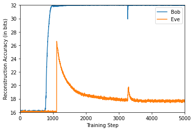

## NN Encryption

The code in this repo asks if neural nets can be trained to learn forms of encryption/decryption. It is based on the paper [Learning To Protect Communications with Adversarial Neural Cryptography](https://arxiv.org/pdf/1610.06918.pdf). The results show that using GAN-style models, you can get two neural nets, Alice and Bob, to communicate in the presence of adversarial third neural net, Eve.

Say Alice has a 32-bit private message, P, she wants to send to Bob. She encodes P into an output C. Both Bob and Eve try to decode C and reconstruct P. Bob has an advantage; he shares a key K with Alice. All the encoders/decoders are parametrized by neural nets. Bob/Alice try to minimize Bob's reconstruction error and maximize Eve's reconstruction error. Eve just cares to minimize her reconstruction error. Training alternates: one minibatch for Alice/Bob and two minibatches for Eve.

The plot below shows the reconstruction errors (in bits) over optimization steps for an example run. At the end of training, Bob is close to perfect, while Eve is behaving only 1-2 bits better better than random. At the beginning both Bob and Eve are random. Bob quickly learns, Eve catches up, but then Alice/Bob are able to come up with a better encryption scheme over the rest of the optimization. There is no "typical" run. In some cases, Bob gets close to perfect quicker and in some cases he fails. Overall, we can get around 75\% of training runs to a state where Bob is close to perfect and Eve is only slightly better than random.



To replicate the analysis, run the ```main.py``` script. Settings are handled with ```hydra``` and can be changed by adding a yaml file to ```config``` directory.